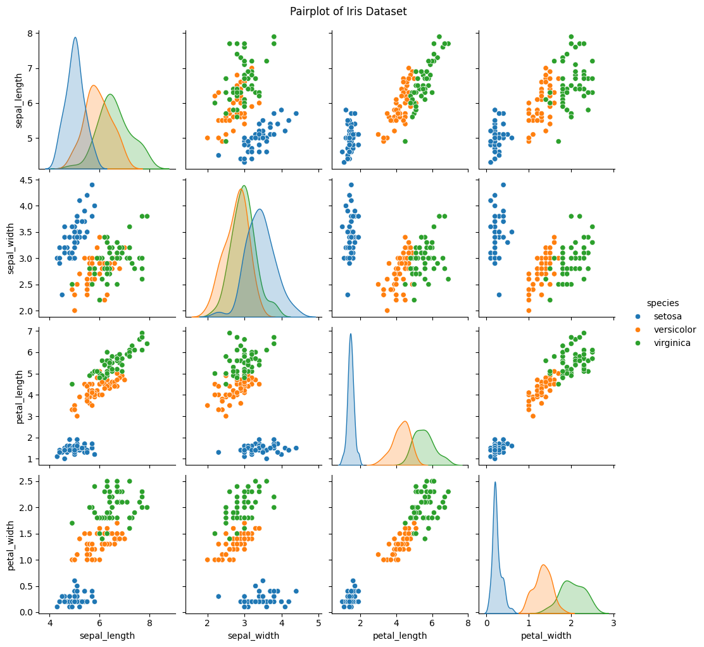
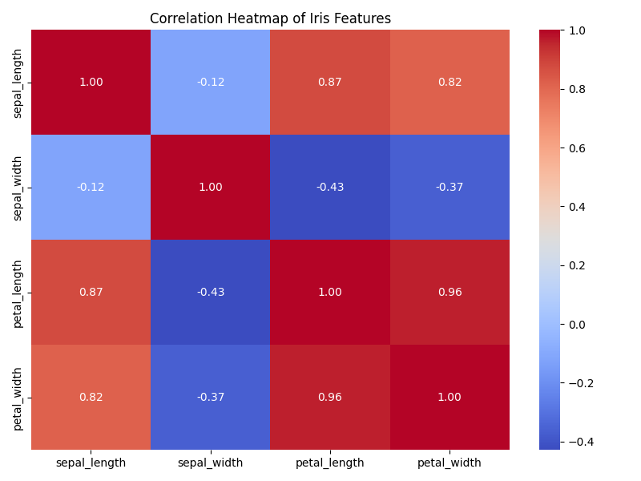

# Iris Data Analysis

This project performs exploratory data analysis (**EDA**), statistical testing, and linear regression modeling on the Iris dataset using Python. It includes summary statistics, correlation analysis, hypothesis testing with SciPy, and visualizations using Seaborn and Matplotlib.

## 📊 Features

- Loads and cleans the Iris dataset
- Computes descriptive statistics (mean, median, standard deviation, variance)
- Generates correlation matrix and visual heatmaps
- Performs a t-test between Iris species
- Runs a linear regression model
- Visualizes data using pairplots and heatmaps

## 🛠️ Requirements

- Windows 10 or later
- Python 3.7 or higher (download from [python.org](https://www.python.org/downloads/))

Required Python packages:

- `numpy`
- `pandas`
- `seaborn`
- `matplotlib`
- `scipy`
- `statsmodels`

## 📦 Installation Steps (Windows)

### 1. Install Python (if not already installed)

Download and install Python from: https://www.python.org/downloads/

Be sure to check the box **"Add Python to PATH"** during installation.

### 2. Clone this repository

```bash
git clone <repository_url>
cd <repository_folder>
```

### 3. Create and activate a virtual environment (optional but recommended)

```bash
python -m venv venv
venv\Scripts\activate
```

### 4. Install dependencies
`pip install -r dependencies.txt`

> dependencies.txt includes: **numpy**, **pandas**, **seaborn**, **matplotlib**, **scipy**, **statsmodels**


```bash
# Create dependencies.txt
echo numpy > dependencies.txt
echo pandas >> dependencies.txt
echo seaborn >> dependencies.txt
echo matplotlib >> dependencies.txt
echo scipy >> dependencies.txt
echo statsmodels >> dependencies.txt

# Install all dependencies
pip install -r dependencies.txt
```

## ▶️ How to Run the Script
1. Open any command line terminal.
2. Navigate to the folder containing the script:
```bash
cd path\to\this\project
```
3. Run the script:
```bash
python iris_data_analysis.py
```

- This will create a results/ folder (if not already present).

- All **logs**, **statistics**, **test results**, **regression summary**, and **plots** will be saved there.

- Console output is also captured in **results/output_log.txt**.

## 📂 Analysis Results

After running the script, all results are saved in the `results/` folder.

### Visualizations

| Pairplot                          | Correlation Heatmap                                     |
|-----------------------------------|---------------------------------------------------------|
|  |  |

### Detailed Outputs

- [Output Log](results/output_log.txt) — Full console output including statistics and test results  
- [Regression Summary](results/regression_summary.txt) — Linear regression detailed report  
- [T-Test Results](results/t_test_results.txt) — Results of the t-test between Setosa and Versicolor

---

*Note:* To view the `.txt` files, open them with any text editor.

